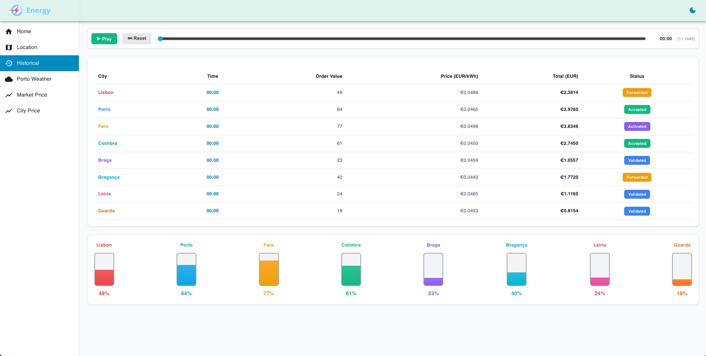
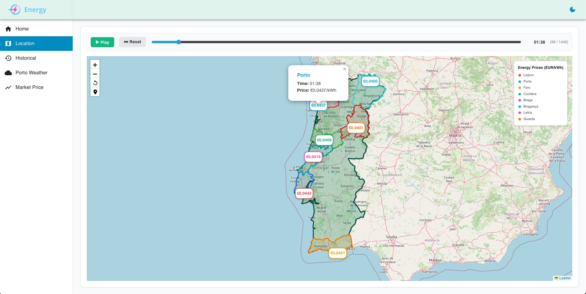
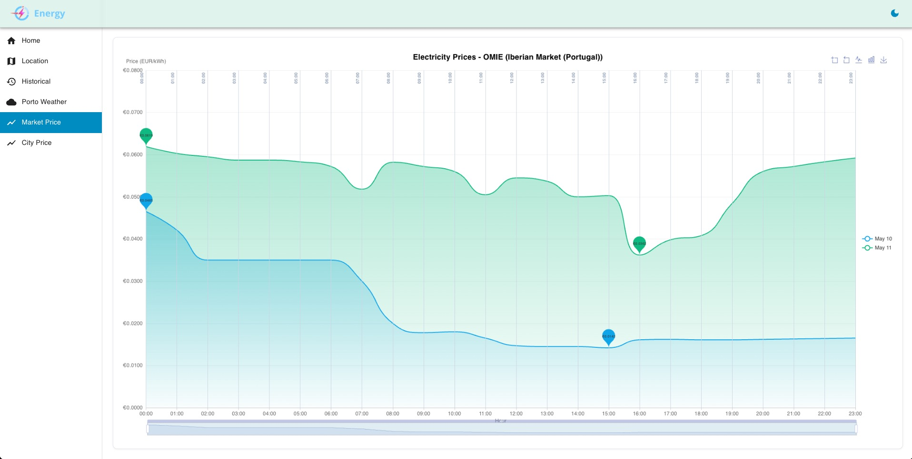

# Energy Market Simulator

A real-time energy market visualization platform that displays electricity prices across Portugal, featuring minute-by-minute pricing data from multiple cities and historical market trends.






## 🔗 Links

- **Live Demo**: [https://devrazec.github.io/energy-market](https://devrazec.github.io/energy-market)
- **Repository**: [https://github.com/devrazec/energy-market](https://github.com/devrazec/energy-market)

## Overview

The Energy Market Simulator is a full-stack web application that provides interactive visualizations of electricity market data for Portugal. It fetches real-time pricing data from OMIE (Operador del Mercado Ibérico de Energía) and generates detailed minute-by-minute price simulations for 8 Portuguese cities, each with regional pricing variations.

## Features

- **Real-time Market Prices**: Hourly electricity prices from OMIE for the Iberian electricity market
- **City-Specific Pricing**: Minute-by-minute price visualization for 8 Portuguese cities:
  - Lisbon (capital, higher prices)
  - Porto (major city)
  - Faro (tourist region)
  - Coimbra
  - Braga
  - Bragança (rural, lowest prices)
  - Leiria
  - Guarda (mountain region)
- **Historical Data Visualization**: Multi-day price comparison with interactive charts
- **Interactive Map**: Real-time price visualization on an interactive map of Portugal using Leaflet
  - Dynamic price markers for all 8 cities
  - Animated playback with minute-by-minute price changes
  - Click and hover interactions on geographic regions
  - Color-coded city boundaries
- **Weather Integration**: Porto weather data correlation with energy prices
- **Interactive Charts**: Built with ECharts for smooth, responsive visualizations
- **Dark Mode Support**: Toggle between light and dark themes
- **Responsive Design**: Optimized for both desktop and mobile devices

## Technology Stack

### Backend
- **Python 3**
- **Requests** for OMIE data fetching
- Real-time data generation and aggregation

### Frontend
- **Next.js 15** (React 19) with App Router
- **Material-UI (MUI)** for component library
- **ECharts** for data visualization
- **Leaflet** with React-Leaflet for interactive maps
  - Dynamic price markers with real-time updates
  - GeoJSON layers for city/district boundaries
  - Custom map controls and animations
- **Emotion** for CSS-in-JS styling
- **Context API** for state management

## Architecture

The application follows a client-server architecture:

1. **Backend** (`/backend`): Python Flask server that:
   - Fetches hourly electricity prices from OMIE API
   - Generates minute-by-minute price simulations with regional multipliers
   - Serves JSON data for multiple cities

2. **Frontend** (`/frontend`): Next.js application that:
   - Displays interactive charts and visualizations
   - Renders interactive maps with Leaflet for geographic price visualization
   - Manages global state with React Context
   - Provides multiple views: Market Price, City Price, Historical, Location, Porto Weather
   - Supports responsive layout with mobile optimization

## Project Structure

```
energy-market/
├── backend/
│   ├── main.py              # Flask server & data generation
│   ├── requirements.txt     # Python dependencies
│   └── README.md           # Backend setup instructions
├── frontend/
│   ├── src/
│   │   └── app/
│   │       ├── components/  # Layout & map components
│   │       ├── context/     # Global state management
│   │       ├── data/        # JSON data files & GeoJSON
│   │       └── pages/       # Application pages
│   ├── package.json        # Node dependencies
│   ├── next.config.mjs     # Next.js configuration
│   └── README.md          # Frontend setup instructions
├── LICENSE
└── README.md
```

## Getting Started

### Prerequisites
- Python 3.x
- Node.js 19+ and npm

### Backend Setup

1. Navigate to the backend directory:
```bash
cd backend
```

2. Create and activate a virtual environment:
```bash
python3 -m venv venv
source venv/bin/activate  # On Windows: venv\Scripts\activate
```

3. Install dependencies:
```bash
pip install -r requirements.txt
```

4. Run the Server:
```bash
python3 main.py
```

### Frontend Setup

1. Navigate to the frontend directory:
```bash
cd frontend
```

2. Install dependencies:
```bash
npm install
```

This will install all required packages including:
- Next.js and React
- Material-UI components
- ECharts for data visualization
- Leaflet and React-Leaflet for interactive maps
- GeoJSON data for Portugal's geographic boundaries

3. Run the development server:
```bash
npm run dev
```

The application will be available at `http://localhost:3000`.

### Build for Production

```bash
npm run build
npm run deploy  # Deploys to GitHub Pages
```

## Data Sources

- **OMIE (Operador del Mercado Ibérico de Energía)**: Real-time hourly electricity market prices for Portugal and Spain
- **Regional Multipliers**: Simulated regional pricing variations based on:
  - Urban vs. rural location
  - Tourism impact
  - Industrial demand
  - Geographic factors

## Pages & Features

### Market Price
View hourly electricity prices from OMIE with multi-day comparison charts.

### City Price
Real-time minute-by-minute price simulation for all 8 cities with animated playback functionality.

### Historical
Historical price trends and comparative analysis across different time periods.

### Location
Interactive map visualization powered by Leaflet displaying:
- Real-time electricity prices for all 8 Portuguese cities
- Color-coded price markers that update dynamically
- Animated playback with play/pause controls and time slider
- Geographic district boundaries with click-to-zoom functionality
- Hover interactions showing detailed price information
- Visual legend indicating city-specific color coding

### Porto Weather
Weather data correlation with energy consumption and pricing patterns.

## Regional Price Multipliers

Each city has a unique price multiplier reflecting real-world market conditions:
- **Lisbon**: 1.05× (capital city premium)
- **Porto**: 1.02× (major urban center)
- **Faro**: 1.08× (tourist region, seasonal demand)
- **Coimbra**: 0.98× (university city)
- **Braga**: 0.97× (northern region)
- **Bragança**: 0.95× (rural, lowest prices)
- **Leiria**: 0.99× (average pricing)
- **Guarda**: 0.96× (mountain region)

## License

See the [LICENSE](LICENSE) file for details.

## Contributing

Contributions are welcome! Please feel free to submit a Pull Request.


